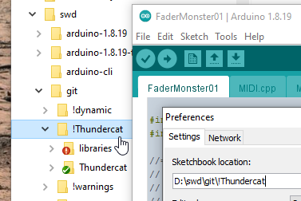
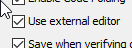

# Submodules needed for FaderMonster 

## Cloning 
- Clone this repo to a folder (Arduino IDE `libraries` folder, maybe? See below)
- Switch to the `ThunderLibs` branch
- `git submodule init` (first time only?)
- `git submodule update` if you think anything upstream might have changed

Need to check if `cores` being in the Arduino libraries causes issues. Shouldn't, no header in its root and no `src` subfolder. _(Doesn't seem to, so far)_

## `cores` preparation 
- copy `cores` to replace your Arduino package's Teensy `cores` (rename the old one, if you like...)

## FreeRTOS preparation
- make sure you've set `#define configTEENSY_ENABLE_HEAP_IN_RAM1 0` in `FreeRTOSConfig.h`

## FaderMonster preparation
- Clone `Thundercat` repo into Arduino IDE sketches folder
- Switch to the `dev/monster-with-main` branch

## Arduino IDE setup
For convenience, at the cost of disc space, a project-specific folder can hold just these libraries and 
the FaderMonster source. The switch your IDE Preferences so the `Sketchbook location` is this folder: 

If using [VSCode](https://code.visualstudio.com/download) as your editor with IDE 1.x, also set the `Use external editor` option: 
 
You can then edit in VSCode, and flip to the IDE to compile and upload.

This is not necessary when using IDE 2.x

